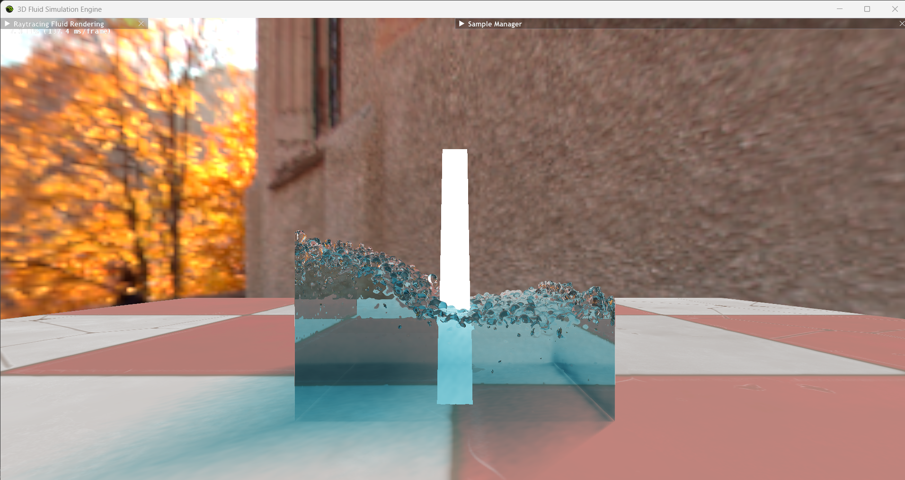

# Ray Tracing SPH Fluid Rendering using Ray Marching and Marching Cubes

This application is the result of a **Bachelor thesis project** in real-time rendering, developed in collaboration between **Olivier Pachoud** and **Constantin Verine** at **SAE Institute Geneva**.

It features a real-time simulation and rendering of a **fluid based on Smoothed Particle Hydrodynamics (SPH)**, using two different rendering techniques:

- **Ray Marching** through a volumetric density texture
- **Marching Cubes** for surface reconstruction from the fluid volume

Two separate `.bat` files are included to launch the application using either algorithm.

## Features

- **Recursive Ray Tracing** (Olivier Pachoud)
- **Ray Marching** for volumetric rendering (Olivier Pachoud)
- **Marching Cubes** for mesh-based representation (Olivier Pachoud)
- **Smoothed Particle Hydrodynamics (SPH)** for fluid dynamics (Constantin Verine)

## Controls
- `F` — Start / Stop the fluid simulation
- `W`, `A`, `S`, `D` — Move the camera
- Mouse movement — Rotate the camera

# Build prerequisites.
## For Falcor:
- Windows 10 version 20H2 (October 2020 Update) or newer, OS build revision .789 or newer
- Visual Studio 2022
- Windows 10 SDK (10.0.19041.0) for Windows 10, version 2004
- A GPU which supports DirectX Raytracing, such as the NVIDIA Titan V or GeForce RTX
- NVIDIA driver 466.11 or newer

## For building
CMake version 3.15 or newer.

# Build instructions.
1. Clone Nvidia's Falcor framework repository.
2. Add a subdirectory to the CMakeLists of falcor Samples (found in Source/Samples/) with this CMake command: 
**add_subdirectory(3DFluidSimulationEngine)**
3. Clone this repository inside the Source/Samples/ folder.
4. If you are working with Visual Studio 2022, you can setup a native Visual Studio solution by running setup_vs2022.bat after cloning this repository. The solution files are written to build/windows-vs2022 and the binary output is located in build/windows-vs2022/bin.
5. You can know run the visual studio solution and set the the 3DFluidSimulationEngine as the startup project.
